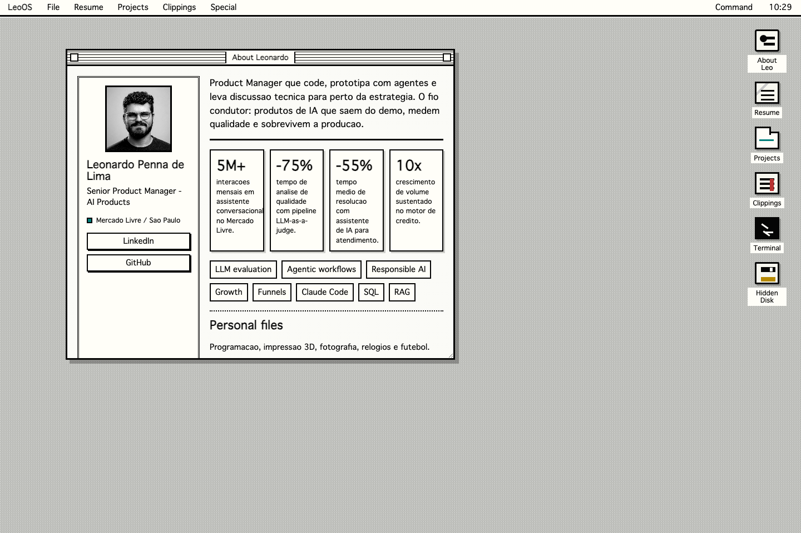

# LeoOS

Portfolio pessoal de [Leonardo Penna de Lima](https://www.linkedin.com/in/leoplima/) em formato de desktop Macintosh clássico. O site é estático, sem build step e sem framework: HTML, CSS e JavaScript vanilla, com uma Vercel Function opcional para o contador de visitas.

[](https://doleo.com.br/)
[](#arquitetura)
[](LICENSE.md)



## Destaques

- Interface inspirada no Macintosh clássico, com janelas arrastáveis, menu bar, dock, terminal e ícones pixelados.
- Conteúdo em português, inglês e espanhol, com seleção de idioma persistida por sessão.
- Layout responsivo com experiência própria para mobile, sem depender de uma landing page separada.
- Terminal interativo com comandos, aliases em múltiplos idiomas e easter eggs.
- Contador de visitas opcional via Vercel Function + Redis REST.
- Open Graph/Twitter Card prontos, incluindo preview em `assets/social/leoos-og.png`.

## Como rodar

Abra `index.html` diretamente no navegador ou sirva a pasta localmente:

```bash
python3 -m http.server 4173
```

Depois acesse:

```text
http://localhost:4173
```

Não há instalação, `npm install`, bundler ou etapa de build.

## Estrutura

```text
.
├── index.html                    # UI, janelas, conteúdo inicial e metatags
├── styles.css                    # Sistema visual, responsivo, ícones CSS e temas
├── app.js                        # Window manager, i18n, terminal, visitas e easter eggs
├── api/
│   └── visits.js                 # Vercel Function opcional para contador de visitas
├── assets/
│   ├── fonts/sysfont/            # Sysfont, licenciado sob OFL
│   └── social/leoos-og.png       # Imagem de compartilhamento social
├── leoos-desktop.png             # Screenshot desktop do projeto
└── leoos-mobile.png              # Screenshot mobile do projeto
```

## Arquitetura

O projeto é deliberadamente simples:

- `index.html` concentra a estrutura das janelas. Cada janela usa `<section class="window" data-window="<id>">`.
- `styles.css` define o sistema visual com custom properties, estados (`is-zoomed`, `is-inverted`, `is-agent-mode`, `is-watch-mode`, `konami`) e o layout mobile.
- `app.js` registra as janelas em `Map<string, Element>`, controla z-index, drag/resize, terminal, i18n e contador de visitas.
- Controles declarativos usam atributos como `data-open`, `data-close`, `data-zoom`, `data-menu`, `data-action` e `data-language`.

Ao adicionar uma janela nova, mantenha o mesmo identificador entre:

1. `data-window="<id>"` no HTML.
2. Botões ou links com `data-open="<id>"`.
3. Aliases opcionais em `normalizeWindowTarget()` no `app.js`.

## Terminal

Comandos principais:

```text
help
whoami
resume
projects
sources
interests
contact
hackatrouble
lookmate
open about
open resume
open projects
open clippings
open terminal
clear
```

Aliases em português e espanhol também são suportados para comandos comuns, como `ajuda`, `abrir`, `curriculo`, `projetos`, `fontes`, `interesses`, `contato` e equivalentes em espanhol.

## Easter eggs

- Konami code alterna o modo de alto contraste retrô.
- Três cliques no relógio ativam o modo relógios.
- Menu `Special` alterna inversão de tela.
- Terminal `claude`, `codex`, `agent` ou `agentic` ativa modo agente.
- Terminal `doleo` responde ao passphrase público.
- Digitar `claude`, `codex`, `leop25`, `lookmate`, `fila` ou `watch` fora do terminal ativa efeitos visuais.

## Contador de visitas

Em produção na Vercel, `api/visits.js` funciona como uma Vercel Function. Conecte um Redis REST, como Upstash Redis, e configure:

```bash
UPSTASH_REDIS_REST_URL
UPSTASH_REDIS_REST_TOKEN
```

Também há suporte para os nomes legados do Vercel KV:

```bash
KV_REST_API_URL
KV_REST_API_TOKEN
```

Opcionalmente, defina `VISIT_COUNTER_KEY` para trocar a chave Redis padrão (`leoos:visits`). Em `file://` ou sem API disponível, a UI mostra o contador como offline sem bloquear a navegação.

## Deploy

O site pode ser publicado em qualquer host estático. Na Vercel:

1. Importe o repositório.
2. Use o preset estático padrão, sem build command.
3. Configure as variáveis do contador de visitas se quiser habilitar `/api/visits`.
4. Confira se `https://doleo.com.br/assets/social/leoos-og.png` responde 200 para preview social.

## Manutenção

Checklist antes de publicar mudanças relevantes:

```bash
node --check app.js
node --check api/visits.js
python3 -m http.server 4173
```

Depois valide manualmente:

- Desktop em largura grande: janelas, menu bar, drag/resize, terminal e contador.
- Mobile em largura estreita: atalhos, abertura de janelas, scroll e tipografia.
- Idiomas `pt`, `en` e `es`.
- Metatags sociais usando um validador de preview quando houver mudança em `index.html` ou `assets/social/leoos-og.png`.

## Fontes e créditos

- Conteúdo público de LinkedIn, GitHub, Product Hunt, São Carlos em Rede, Medium/CATI Jr. e about.me.
- GitHub público: <https://github.com/leop25>
- LookMate no Product Hunt: <https://www.producthunt.com/products/lookmate?launch=lookmate>
- Fila Digital / Hackatrouble: <https://saocarlosemrede.com.br/estudantes-da-ufscar-criam-app-para-acabar-com-filas-durante-a-pandemia/>
- Artigo UX / CATI Jr.: <https://medium.com/%40catijr/user-experience-mais-do-que-um-app-bonito-46cdd3047ffe>
- Sysfont por Alina Sava, sob SIL Open Font License: <https://fontsarena.com/sysfont-by-alina-sava/>

## Licença

O código do projeto está sob MIT. Conteúdo pessoal, textos, imagens de perfil e screenshots do portfolio têm direitos reservados. A fonte Sysfont mantém a própria licença OFL. Veja [LICENSE.md](LICENSE.md).
